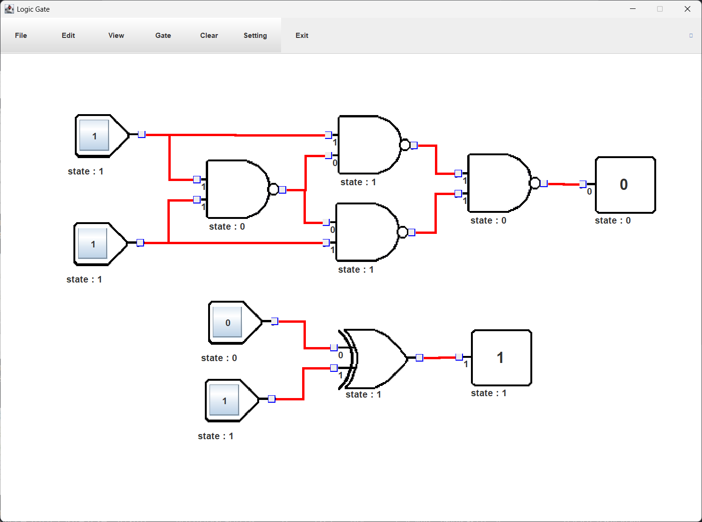
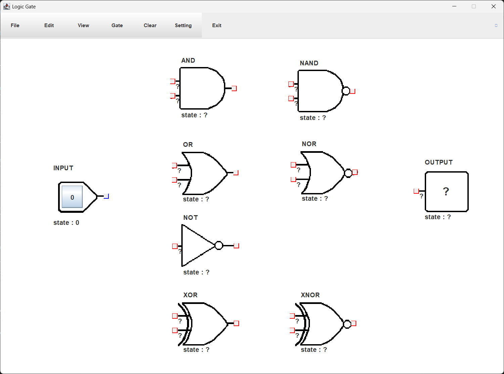
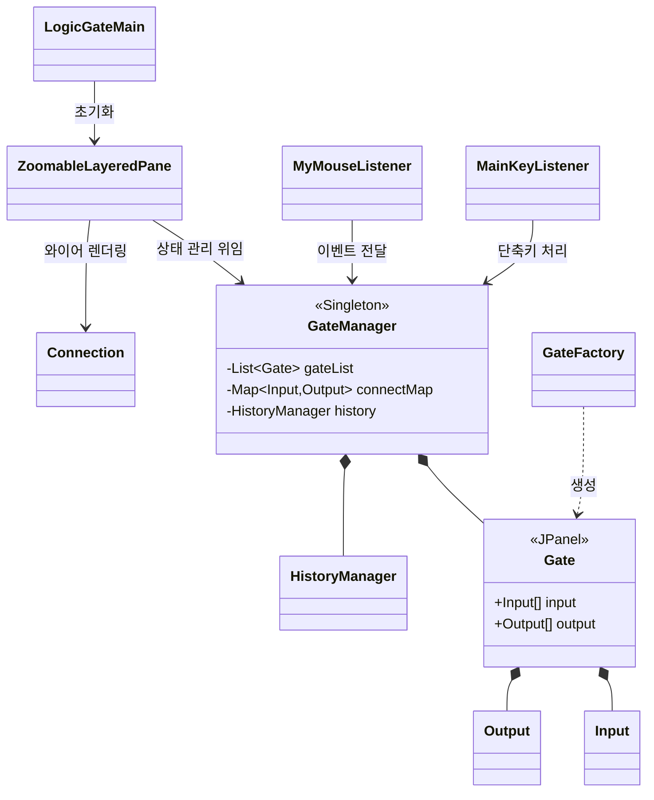
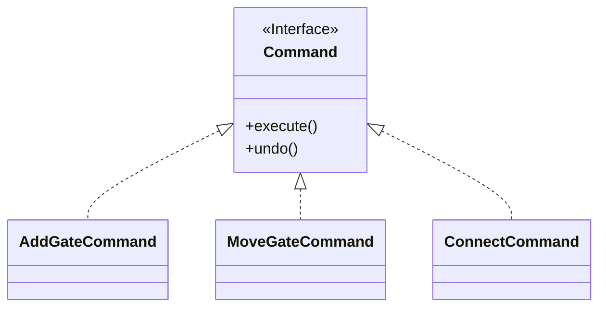
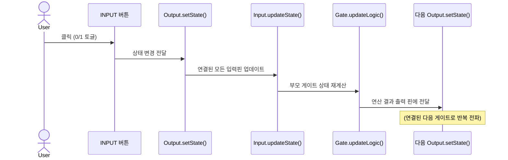

# 🔌 LogicGate Simulator

> **Java Swing 기반 디지털 논리 회로 시뮬레이터**



**논리 게이트를 캔버스에 자유롭게 배치하고, 와이어로 연결하여 디지털 회로의 동작을 실시간으로 시뮬레이션하는 데스크톱 애플리케이션입니다.**

<br>

## 📌 프로젝트 개요

| 항목 | 내용 |
|------|------|
| **개발 기간** | 2025 1학기 |
| **개발 형태** | 자바 프로그래밍 수업 프로젝트 |
| **개발 언어** | Java |
| **GUI 프레임워크** | Java Swing / AWT |
| **주요 기능** | 논리 게이트 배치, 와이어 연결, 실시간 상태 계산, 실행 취소/다시 실행 |

<br>

## 🎯 핵심 기능

### 🧩 논리 게이트 지원
9가지 표준 논리 게이트를 제공합니다.



| 게이트 | 설명 | 지원 Input 수 |
|--------|------|--------------|
| **INPUT** | 사용자가 0/1을 직접 토글하는 입력 소자 | - |
| **OUTPUT** | 회로의 최종 출력값을 표시 | 1 |
| **AND** | 모든 입력이 1일 때만 1 출력 | 2~5 |
| **OR** | 하나 이상의 입력이 1이면 1 출력 | 2~5 |
| **NOT** | 입력의 반전값 출력 | 1 |
| **NAND** | AND의 반전 | 2~5 |
| **NOR** | OR의 반전 | 2~5 |
| **XOR** | 두 입력이 다를 때 1 출력 | 2 |
| **XNOR** | XOR의 반전 | 2 |

### 🖱️ 인터랙션
- **드래그 앤 드롭**: 게이트를 마우스로 자유롭게 배치 및 이동
- **와이어 연결**: Output 핀 → Input 핀 드래그로 게이트 간 연결
- **박스 드래그 다중 선택**: 우클릭 드래그로 여러 게이트 동시 선택 및 이동
- **삭제**: 드래그 후 하단 `REMOVE` 영역에 드롭하여 삭제
- **INPUT 버튼 클릭**: 클릭 한 번으로 입력값 0/1 토글

### ⌨️ 단축키

| 단축키 | 기능 |
|--------|------|
| `Ctrl + Z` | 실행 취소 (Undo) |
| `Ctrl + Y` | 다시 실행 (Redo) |
| `Ctrl + S` | 회로 저장 |
| `Ctrl + O` | 회로 불러오기 |
| `Ctrl + N` | 전체 초기화 |
| `Ctrl + +` | 확대 (Zoom In) |
| `Ctrl + -` | 축소 (Zoom Out) |
| `W A S D` | 선택된 게이트 이동 |
| `ESC` | 프로그램 종료 |

### ⚙️ 설정 (Setting 메뉴)
- **게이트 이름 표시/숨기기**: 각 게이트의 타입 라벨 On/Off
- **입출력 상태 표시/숨기기**: 각 핀의 현재 0/1 상태 On/Off
- **게이트 이동 속도 설정**: 키보드 이동 시 스텝 크기 조정
- **Output 선 색상 변경**: 게이트별로 와이어 색상 커스터마이징

<br>

## 🏛️ 아키텍처

### 클래스 구조



### 적용된 디자인 패턴

#### 🔹 싱글톤 패턴 (Singleton)
`GateManager`는 게이트 목록, 연결 맵, Undo/Redo 히스토리, 확대/축소 배율 등 애플리케이션의 핵심 상태를 단일 인스턴스로 중앙 관리합니다.

```java
public class GateManager {
    private static GateManager instance = new GateManager();
    public static GateManager getInstance() { return instance; }
}
```

#### 🔹 팩토리 패턴 (Factory)
`GateFactory`가 게이트 유형에 따른 객체 생성을 전담합니다. Java 람다를 활용해 게이트별 논리 연산을 함수 객체(`Runnable updateLogic`)로 깔끔하게 주입합니다.

```java
// AND 게이트 논리를 람다로 정의
newGate.updateLogic = () -> {
    int tempState = newGate.input[0].getState();
    for (int i = 1; i < newGate.getInputNum(); i++) {
        tempState &= newGate.input[i].getState();
    }
    newGate.setState(tempState);
};
```

#### 🔹 커맨드 패턴 (Command)
게이트 추가, 이동, 연결 등 모든 사용자 액션을 `Command` 객체로 캡슐화하여 Undo/Redo를 완벽히 지원합니다.



```java
// HistoryManager: ArrayDeque 기반 Undo/Redo 스택
public void doCommand(Command cmd) {
    cmd.execute();
    undoStack.push(cmd);
    redoStack.clear();  // 새 액션 수행 시 Redo 스택 초기화
}
```

### 신호 전파 메커니즘
게이트 간의 상태 변화는 **Observer 방식으로 자동 전파**됩니다.



<br>

## 🖼️ 렌더링 방식

**직각 라우팅 (Manhattan Routing)**: 실제 전자 회로도와 유사하게, 두 핀 사이의 와이어는 대각선이 아닌 직각(수평·수직)으로 꺾여 그려집니다.

```java
// Connection.java - 두 점 사이의 직각 라우팅 계산
Point mid = new Point((start.x + end.x) / 2, (start.y + end.y) / 2);
if (start.x < end.x) {
    g2d.drawLine(start.x, start.y, mid.x, start.y); // 수평
    g2d.drawLine(mid.x, start.y, mid.x, end.y);     // 수직
    g2d.drawLine(mid.x, end.y, end.x, end.y);       // 수평
}
```

<br>

## 🚀 실행 방법

### 요구 사항
- **JDK 8 이상**

### 빌드 및 실행

```bash
# 저장소 클론
git clone https://github.com/jkh0515/LogicGate-Java.git
cd LogicGate-Java

# bin 폴더 생성 (컴파일된 클래스 파일 저장용)
mkdir bin
```

### 🪟 Windows 환경
```cmd
# 컴파일
javac -d bin src/*.java

# 실행 (이미지 리소스 경로를 위해 src 디렉토리를 클래스패스에 포함)
java -cp "bin;src" LogicGateMain
```

### 🍎 Mac / 🐧 Linux 환경
```bash
# 컴파일
javac -d bin src/*.java

# 실행
java -cp bin:src LogicGateMain
```

<br>

## 📁 프로젝트 구조

```
LogicGate-Java/
├── src/
│   ├── LogicGateMain.java       # 진입점, 윈도우 초기화
│   ├── Gate.java                # 게이트 기본 UI 컴포넌트
│   ├── GateFactory.java         # 게이트 생성 팩토리
│   ├── GateManager.java         # 싱글톤 상태 관리자
│   ├── Connection.java          # 와이어 렌더링 패널
│   ├── Input.java               # 입력 핀
│   ├── Output.java              # 출력 핀
│   ├── InOutBox.java            # Input/Output 공통 부모
│   ├── MyMouseListener.java     # 마우스 이벤트 핸들러
│   ├── MainKeyListener.java     # 키보드 이벤트 핸들러
│   ├── Menu.java                # 메뉴바
│   ├── MenuItemListener.java    # 메뉴 액션 핸들러
│   ├── Command.java             # 커맨드 인터페이스
│   ├── AddGateCommand.java      # 게이트 추가 커맨드
│   ├── MoveGateCommand.java     # 게이트 이동 커맨드
│   ├── ConnectCommand.java      # 와이어 연결 커맨드
│   ├── HistoryManager.java      # Undo/Redo 관리자
│   ├── ZoomableLayeredPane.java # 확대/축소 레이어드 패널
│   ├── Pair.java                # 좌표 유틸리티
│   └── img/                     # 게이트 이미지 리소스
└── LogicGate.cld                # 저장 회로 예시 파일
```

<br>

## 💡 구현 포인트

- **실시간 신호 전파**: 입력이 변경되면 연결된 모든 하위 게이트의 상태가 즉시 재계산되어 화면에 반영됩니다.
- **파일 입출력**: Java 직렬화(Serialization)를 통해 현재 회로 상태를 `.cld` 파일로 저장하고 불러올 수 있습니다. (`Gate`, `Connection`, `Input`, `Output` 모두 `Serializable` 구현)
- **Input 수 동적 변경**: 중간 클릭 메뉴를 통해 게이트의 Input 핀 수를 런타임에 동적으로 변경할 수 있으며, 기존 연결을 최대한 보존합니다.
- **Zoom 기능**: `AffineTransform`을 활용한 `ZoomableLayeredPane`으로 전체 캔버스를 스케일링하며, 마우스 좌표도 배율에 맞게 보정하여 정확한 클릭을 보장합니다.
